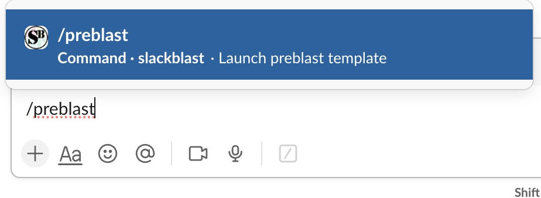
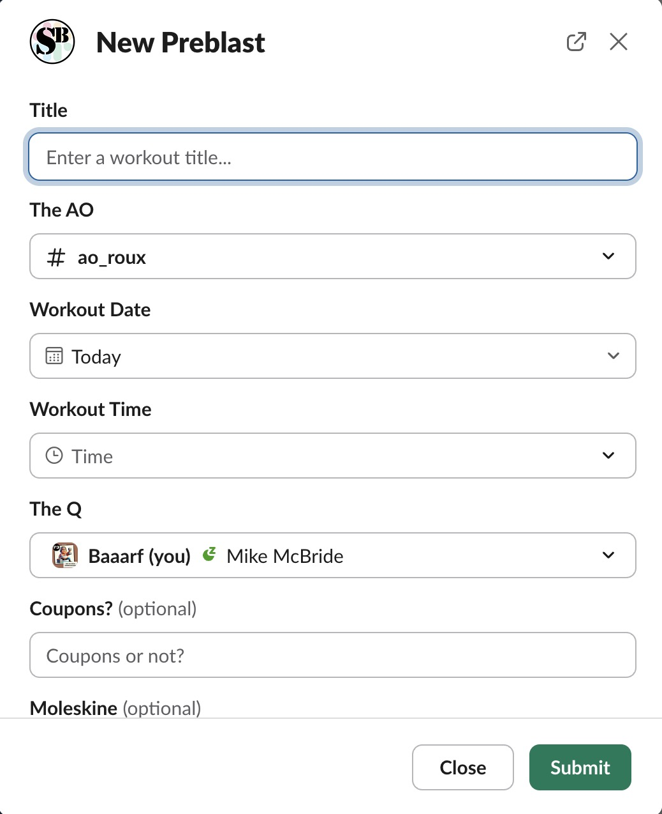
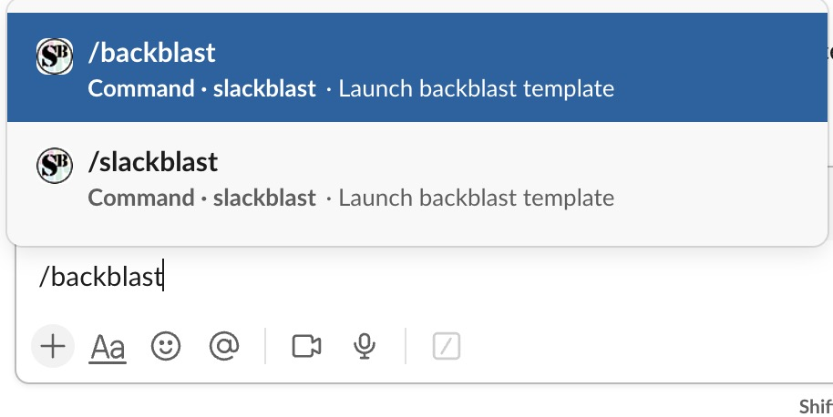

import { slackLinks } from '../../data/resources.ts';
import { CardGrid, LinkCard } from '@astrojs/starlight/components';

## What is Slack?

Slack is a cloud-based messaging and collaboration platform used by teams. It allows users to communicate through channels and direct messages. It also provides integrations to other platforms through apps that can be installed to your workspace.

## How We Use Slack

In F3, we use Slack to communicate when a beatdown is going to happen (we call this a Preblast), post a recap of a beatdown or Qsource after it occurred (a Backblast), and share information in various channels related to things going on in the region.

Our Nant'an (the leader of our SLT) will generally post weekly updates about what is going on across the region.

We also make heavy use of Slack Apps to sign up to Q a beatdown (Qsignups), post Preblasts and Backblasts (Slackblast), sync user info from Slack to our database (PAXminer), and post achievements (WeaselBot). You can read more about each of these apps below.

### A Brief History of F3 Slack Apps

Before we dive in to the specifics of Slackblast, a little context will be helpful for how we ended up where we are. The first Slack app was PAXminer, created by Moneyball (a fellow St. Louisan), to scrape user data and backblast info. It ran an hourly sync job and would scan posts in all the Slack channels where it was configured to run and would look for posts beginning with the word "BACKBLAST" in all caps. It would then proceed to parse the rest of the message and look for other fields to try and map it into the correct database columns.

This worked, but it was finicky. If a post had a space at the beginning of the line with one of the database column fields, it would not pick it up. The person posting had to be diligent about using the proper format for a Backblast message, and often times errors would be difficult to track down. PAXminer would also only scrape for messages posted in the last 7 days, so if something didn't get fixed in time, an admin with database access would have to manually update the information in the database.

To improve upon the issues in PAXminer, Moneyball wrote a new app called Slackblast, which instead of relying on parsing messages, implements a form inside of Slack using the UI components that Slack gives us. You fill out the form, and when you click Submit, the app posts your data directly to the database. No waiting for a scheduled job to sync and parse, no formatting errors. It was a huge improvement over the old method.

### Slackblast

#### What is Slackblast

Slackblast is the app we use to post Preblasts and Backblasts. It provides a modal interface to fill out a form that will then submit the Backblast data directly into the database. Preblast data is not saved in a database, but the next version of Slackblast will provide HC/Un-HC buttons rather than using the emoji reaction.

#### How to use Slackblast

##### Creating a Preblast

To create a Preblast, type `/preblast` in the message field and then press Enter/Return. Alternatively, you can invoke the "Run shortcut" menu by pressing the icon at the bottom of the message field that looks like a `/`.

After pressing Enter, you will get a modal popup where you can fill out the Preblast form. Once it is submitted, you'll see a new post in the channel with your Preblast information.

---

##### Creating a Backblast

To create a Backblast, you can type `/backblast` OR `/slackblast` (either one works, they do the same thing) in the message field and then press Enter. Similarly, you can use the `/` icon to open the Run menu (pro tip: all that button does is type a `/` in your message field).

After pressing Enter, you will get a modal popup where you can fill out all the information for the Backblast. See the screen recording below.

Some important things to note:

- AO channel/where this BB posts
- Typeahead user picker can be tricky, especially for users on mobile. This is unfortunately a Slack thing, and not something that we can control.

<video controls><source src="/videos/slack/demo_backblast.mp4" /></video>

---

##### QSource Backblasts

To post a backblast for a QSource event, you should also use the Slackblast app. Follow the same mechanism as above, but make sure to do the following:

1. Invoke the `/slackblast` command in the `#qsource` channel. This is important.
2. In the field for AO, select the AO at which QSource took place. In the past, manual backblast entries required you to put `#qsource` as the value for the AO. Do not do that.
3. In the field for "Choose where to post this", select "Current channel" from the dropdown.
4. Optional, but helpful: in the "Event Type" dropdown, select QSource from the list.

### Qsignups

### PAXminer

### WeaselBot

## External Resources

<CardGrid>
{slackLinks.map(link => <LinkCard title={link.title} href={link.url} description={link.description} target="_blank" rel="noopener noreferer" />
)}
</CardGrid>
